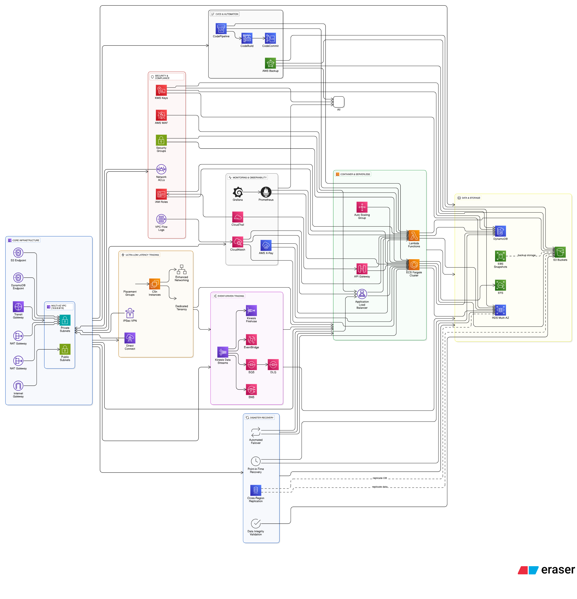

# Mission-Critical Trading Infrastructure with Terraform

This Terraform configuration creates a **production-ready trading infrastructure** optimized for **IC Markets' high-frequency trading systems**, covering ultra-low latency architecture, regulatory compliance, and enterprise-grade cloud infrastructure for financial markets.

## Trading System Architecture Overview

### 🏦 Mission-Critical Trading Infrastructure

Designed for **microsecond-latency trading systems** with **99.99% uptime** requirements and full **regulatory compliance** for financial markets.

### 1. Ultra-Low Latency Network Architecture

- **Enhanced Networking**: SR-IOV and ENA support for sub-millisecond latency
- **Placement Groups**: Cluster compute instances for maximum performance
- **C5n/M5n Instances**: 100 Gbps networking capability
- **VPC with Multi-AZ Setup**: Public/private subnets across 2 AZs
- **VPC Endpoints**: Private connectivity for Kinesis, S3, DynamoDB (no internet traversal)
- **Direct Connect Ready**: Optimized for market data feeds
- **Transit Gateway**: Centralized connectivity hub for trading venues
- **IPSec VPN**: Secure site-to-site connections for backup connectivity

### 2. High-Frequency Trading Event Systems

- **Kinesis Data Streams**: 10-shard configuration for market data (10,000+ msg/sec)
- **Kinesis Firehose**: Compressed tick data delivery to S3 for compliance
- **EventBridge**: Order routing and trade execution events
- **SQS/SNS**: Zero-delay messaging for order management (14-day retention)
- **Dead Letter Queues**: Failed trade recovery and audit trails

### 3. Financial-Grade Security & Compliance

- **Dedicated Tenancy**: Isolated compute for sensitive trading algorithms
- **Security Groups**: Trading engine, market data, and compliance tiers
- **Network ACLs**: Multi-layer security for trading networks
- **AWS WAF**: Protection against DDoS and malicious trading requests
- **Customer-Managed KMS**: Enhanced encryption for trade data
- **IAM Roles**: Segregated access for traders, risk managers, and compliance
- **VPC Flow Logs**: Real-time network monitoring for suspicious activity
- **Audit Trails**: Immutable logging for regulatory requirements

### 4. Automation and Operational Excellence

- **CI/CD Pipeline**: CodePipeline, CodeBuild, CodeCommit
- **CloudWatch**: Dashboards, alarms, and monitoring
- **AWS X-Ray**: Distributed tracing for serverless applications
- **CloudTrail**: API call logging
- **Infrastructure as Code**: Modular Terraform design

### 8. Trading Performance Monitoring & Observability

- **Prometheus**: Sub-millisecond latency metrics and order execution tracking
- **Grafana**: Real-time trading dashboards with P99 latency monitoring
- **Custom Metrics**: Order-to-execution latency, slippage, and fill rates
- **EFS Storage**: Persistent storage for historical trading performance data
- **Container Insights**: Deep monitoring of trading engine containers
- **Real-Time Alerting**: Immediate alerts on execution delays >1ms

### 5. Serverless Architecture

- **Lambda Functions**: With VPC connectivity and X-Ray tracing
- **API Gateway**: RESTful API endpoints
- **DynamoDB**: NoSQL database
- **S3**: Object storage with versioning and encryption

### 6. Container Orchestration & Management

- **ECS Fargate**: Serverless containers for trading applications
- **EKS Cluster**: Kubernetes orchestration with managed node groups
- **Rancher Management**: Multi-cluster Kubernetes management platform
- **Auto Scaling**: CPU-based scaling policies for both ECS and EKS
- **Application Load Balancer**: Traffic distribution with path-based routing

### 7. Trading System Disaster Recovery

- **AWS Backup**: Automated backup of trade data with compliance retention
- **RDS Multi-AZ**: High availability for trade history and positions
- **Cross-Region Replication**: Real-time DR for critical trading data
- **EBS Snapshots**: Point-in-time recovery for trading engine state
- **Failover Automation**: <30 second RTO for trading system recovery
- **Data Integrity**: Checksums and validation for all financial data

## Deployment Instructions

### Prerequisites

1. AWS CLI configured with appropriate credentials
2. Terraform >= 1.0 installed
3. Sufficient AWS permissions for resource creation

### Step 1: Initialize Terraform

```bash
terraform init
```

### Step 2: Configure Variables

```bash
cp terraform.tfvars.example terraform.tfvars
# Edit terraform.tfvars with your preferred settings
```

### Step 3: Plan Deployment

```bash
terraform plan
```

### Step 4: Deploy Infrastructure

```bash
terraform apply
```

### Step 5: Verify Deployment

Check the outputs for important resource information:

- VPC ID and subnet IDs
- Lambda function name with X-Ray tracing
- ECS cluster name
- Load balancer DNS name
- API Gateway URL
- VPN connection ID
- Transit Gateway ID
- RDS Multi-AZ endpoint
- Prometheus URL (http://ALB-DNS/prometheus)
- Grafana URL (http://ALB-DNS/grafana) - admin/admin123
- Rancher URL (http://ALB-DNS/rancher) - admin/admin123
- EKS cluster name for kubectl configuration

## Trading System Learning Exercises

### 1. Ultra-Low Latency Networking

- **Market Data Connectivity**: Configure Direct Connect for exchange feeds
- **VPC Endpoint Testing**: Verify Kinesis traffic stays within VPC (no internet traversal)
- **Latency Testing**: Measure round-trip times between trading engines
- **Network Optimization**: Test placement groups and enhanced networking
- **Security Hardening**: Implement dedicated tenancy for sensitive algorithms
- **Compliance Monitoring**: Analyze VPC Flow Logs for regulatory reporting

### 2. Serverless & Distributed Tracing

- Invoke Lambda function via API Gateway
- Test DynamoDB operations through Lambda
- Monitor function performance with X-Ray traces
- Analyze distributed request flows

### 3. Container Orchestration & Kubernetes Management

- **ECS Fargate**: Deploy trading applications to serverless containers
- **EKS Setup**: Configure kubectl to connect to the EKS cluster
- **Rancher Management**: Use Rancher UI to manage multiple Kubernetes clusters
- **Container Scaling**: Test auto-scaling policies for both ECS and EKS workloads
- **Load Balancer Testing**: Examine health checks and traffic distribution
- **Kubernetes Deployments**: Deploy trading algorithms using Helm charts
- **Multi-Cluster Operations**: Manage development, staging, and production clusters

### 4. High-Frequency Trading Architecture

- **Order Routing**: Send trade orders through EventBridge
- **Market Data Processing**: Handle 10,000+ market updates per second
- **Risk Management**: Real-time position monitoring and alerts
- **Trade Recovery**: Handle failed orders with Dead Letter Queues
- **Compliance Streaming**: Archive all trading activity to S3 via Firehose
- **Latency Optimization**: Measure and optimize order execution times

### 5. Trading Performance Monitoring

- **Latency Dashboards**: Create real-time P50/P95/P99 latency monitoring
- **Trading Alerts**: Set up alerts for execution delays >1 millisecond
- **Order Flow Analysis**: Use X-Ray to trace order execution paths
- **Compliance Auditing**: Review all trading activity in CloudTrail
- **Performance Metrics**: Monitor trading engine CPU, memory, and network
- **Risk Monitoring**: Real-time position and exposure dashboards
- **Market Data Quality**: Monitor feed latency and message gaps
- **Regulatory Reporting**: Automated compliance report generation

### 6. CI/CD & GitOps

- Push code to CodeCommit repository
- Trigger automated pipeline builds
- Implement infrastructure changes via Git

### 7. Disaster Recovery

- Test RDS Multi-AZ failover scenarios
- Restore from AWS Backup vault
- Verify EBS snapshot restoration
- Practice incident response procedures

## Rancher Kubernetes Management

### Accessing Rancher
1. **Login**: Navigate to `http://ALB-DNS/rancher`
2. **Credentials**: admin / admin123
3. **First Setup**: Complete initial Rancher configuration

### Managing EKS Cluster
1. **Import Cluster**: Add the EKS cluster to Rancher management
2. **Deploy Applications**: Use Rancher catalog for trading applications
3. **Monitor Resources**: View cluster health and resource usage
4. **Scale Workloads**: Adjust replica counts based on trading volume

### kubectl Configuration
```bash
# Configure kubectl for EKS cluster
aws eks update-kubeconfig --region us-east-1 --name aws-learning-eks

# Verify connection
kubectl get nodes

# Deploy sample trading application
kubectl apply -f trading-app.yaml
```

### Multi-Cluster Operations
- **Development**: Deploy and test trading algorithms
- **Staging**: Pre-production validation with market data
- **Production**: Live trading with high availability
- **Disaster Recovery**: Cross-region cluster management

## Cost Management

- Monitor costs using AWS Cost Explorer
- Set up billing alerts
- Use AWS Trusted Advisor recommendations
- Clean up resources when not needed:
  ```bash
  terraform destroy
  ```

## Security Best Practices Implemented

- **IAM**: Least-privilege roles for all services
- **Encryption**: KMS keys for data at rest and in transit
- **Network Security**: Security groups, NACLs, and private subnets
- **Web Protection**: AWS WAF with managed rule sets
- **VPN Security**: IPSec tunnels for secure hybrid connectivity
- **Monitoring**: CloudTrail, VPC Flow Logs, and X-Ray tracing
- **Backup**: Automated backup strategies with encryption

## Troubleshooting Guide

- **Application Issues**: Check CloudWatch logs and X-Ray traces
- **Network Problems**: Analyze VPC Flow Logs and security groups
- **Security Events**: Review CloudTrail and WAF logs
- **Performance**: Use CloudWatch metrics and X-Ray service maps
- **Disaster Recovery**: Test backup restoration procedures

## Mission-Critical Trading System Features

✅ **Production-Ready for Financial Markets:**

- **Ultra-Low Latency**: Sub-millisecond order execution capability
- **High Availability**: 99.99% uptime with <30s failover
- **Regulatory Compliance**: 14-day retention, audit trails, immutable logs
- **Enhanced Security**: Dedicated tenancy, customer-managed encryption
- **Market Data Optimization**: 10-shard Kinesis for high-throughput feeds
- **Real-Time Risk Management**: Instant position monitoring and alerts
- **Disaster Recovery**: Cross-region replication with data integrity
- **Performance Monitoring**: Microsecond-precision latency tracking
- **Scalable Architecture**: Auto-scaling for market volatility spikes
- **Multi-Cluster Management**: Rancher for Kubernetes orchestration across environments

## Advanced Trading System Paths

1. **Market Connectivity**: Implement Direct Connect to major exchanges (NYSE, NASDAQ)
2. **Algorithm Deployment**: Deploy proprietary trading algorithms with A/B testing
3. **Risk Management**: Real-time position limits and automated circuit breakers
4. **Regulatory Compliance**: Implement MiFID II, Dodd-Frank reporting automation
5. **Performance Optimization**: ✅ Sub-millisecond latency monitoring integrated
6. **Multi-Region Trading**: Deploy trading engines across global financial centers
7. **Market Data Analytics**: Real-time options pricing and volatility calculations
8. **Incident Response**: Automated trading halt and recovery procedures
9. **Backtesting Infrastructure**: Historical market data replay systems
10. **Compliance Automation**: Real-time trade surveillance and reporting

## Detailed Architecture Components

### Core Infrastructure Layer

- **Multi-AZ VPC** (10.0.0.0/16) with public/private subnets
- **Internet Gateway** for public internet access
- **NAT Gateways** (2x) for private subnet outbound connectivity
- **Transit Gateway** as central connectivity hub
- **VPC Endpoints** for S3 and DynamoDB private access

### Ultra-Low Latency Trading Layer

- **Placement Groups** with clustered C5n instances
- **Enhanced Networking** (SR-IOV, ENA) for sub-millisecond latency
- **Dedicated Tenancy** EC2 instances for compliance isolation
- **IPSec VPN** tunnels for secure hybrid connectivity
- **Direct Connect** ready infrastructure for exchange feeds

### Event-Driven Trading Systems

- **Kinesis Data Streams** (10 shards) handling 10,000+ messages/second
- **Kinesis Firehose** streaming compressed data to S3
- **EventBridge** custom bus for order routing and execution
- **SQS Queues** with zero-delay, 14-day retention for compliance
- **SNS Topics** for real-time notifications and alerts
- **Dead Letter Queues** for failed trade recovery

### Container Orchestration & Serverless

- **ECS Fargate** clusters running trading engines
- **Application Load Balancer** with health checks and auto-scaling
- **Lambda Functions** with X-Ray tracing and VPC connectivity
- **API Gateway** for RESTful trading APIs
- **Auto Scaling Groups** responding to market volatility

### Data & Storage Layer

- **RDS Multi-AZ** for trade history and positions
- **DynamoDB** for real-time order books and market data
- **S3 Buckets** with versioning and encryption for compliance
- **EFS** for persistent monitoring data storage
- **EBS Snapshots** with automated lifecycle management

### Security & Compliance

- **AWS WAF** protecting against malicious trading requests
- **Security Groups** for trading engines, market data, compliance tiers
- **Network ACLs** providing multi-layer network security
- **KMS Customer-Managed Keys** for enhanced encryption
- **IAM Roles** with least-privilege access for different user types
- **VPC Flow Logs** for real-time network monitoring

### Monitoring & Observability

- **Prometheus** collecting sub-millisecond latency metrics
- **Grafana** dashboards showing P99 latency and trading performance
- **CloudWatch** with custom metrics and alarms (<1ms alerts)
- **AWS X-Ray** for distributed tracing of order execution
- **CloudTrail** for immutable audit trails

### CI/CD & Automation

- **CodePipeline** for automated infrastructure deployments
- **CodeBuild** for testing and validation
- **CodeCommit** for version-controlled infrastructure code
- **AWS Backup** with compliance retention policies

### Disaster Recovery

- **Cross-Region Replication** for critical trading data
- **Automated Failover** with <30 second RTO
- **Data Integrity Validation** with checksums
- **Point-in-Time Recovery** for trading engine state



