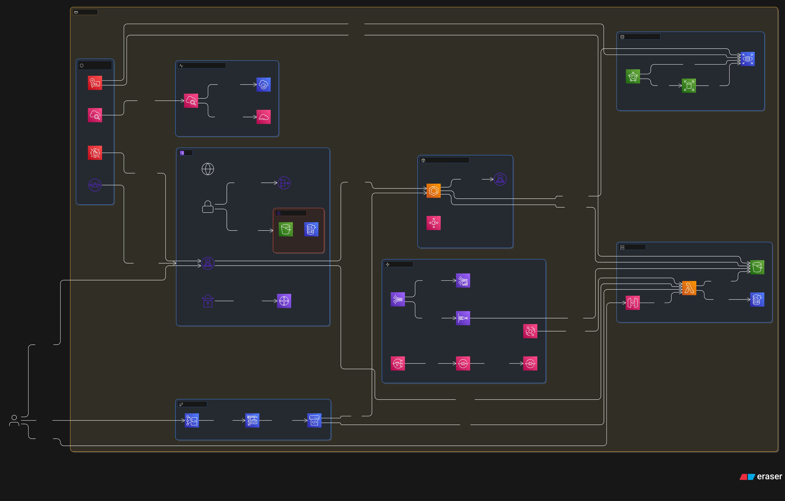

# AWS Environment with Terraform

This Terraform configuration creates a comprehensive AWS environment covering all major AWS services and architectural patterns for enterprise-grade cloud infrastructure.

## Architecture Overview

### 1. Cloud Infrastructure Implementation
- **VPC with Multi-AZ Setup**: Public/private subnets across 2 AZs
- **NAT Gateways**: For private subnet internet access
- **VPC Endpoints**: S3 and DynamoDB for private connectivity
- **Load Balancers**: Application Load Balancer with auto-scaling
- **Transit Gateway**: Centralized connectivity hub
- **IPSec VPN**: Site-to-site VPN connections for hybrid cloud

### 2. Event-Based Systems
- **Kinesis Data Streams**: Real-time data streaming
- **Kinesis Firehose**: Data delivery to S3
- **Kinesis Data Analytics**: Real-time stream processing with SQL
- **EventBridge**: Custom event bus with rules and targets
- **SQS/SNS**: Pub/sub messaging with Dead Letter Queues

### 3. Networking and Security
- **Security Groups**: Web, ECS, ALB, and Lambda security groups
- **Network ACLs**: Additional network-level security
- **AWS WAF**: Web Application Firewall with managed rule sets
- **KMS**: Encryption key management
- **IAM Roles**: Least-privilege access for all services
- **VPC Flow Logs**: Network traffic monitoring

### 4. Automation and Operational Excellence
- **CI/CD Pipeline**: CodePipeline, CodeBuild, CodeCommit
- **CloudWatch**: Dashboards, alarms, and monitoring
- **AWS X-Ray**: Distributed tracing for serverless applications
- **CloudTrail**: API call logging
- **Infrastructure as Code**: Modular Terraform design

### 5. Serverless Architecture
- **Lambda Functions**: With VPC connectivity and X-Ray tracing
- **API Gateway**: RESTful API endpoints
- **DynamoDB**: NoSQL database
- **S3**: Object storage with versioning and encryption

### 6. Container Orchestration
- **ECS Fargate**: Serverless containers
- **Auto Scaling**: CPU-based scaling policies
- **Application Load Balancer**: Traffic distribution

### 7. Disaster Recovery
- **AWS Backup**: Automated backup with lifecycle policies
- **RDS Multi-AZ**: High availability database deployment
- **EBS Snapshots**: Automated snapshot management with DLM
- **Cross-AZ Redundancy**: Multi-AZ deployment patterns

## Deployment Instructions

### Prerequisites
1. AWS CLI configured with appropriate credentials
2. Terraform >= 1.0 installed
3. Sufficient AWS permissions for resource creation

### Step 1: Initialize Terraform
```bash
terraform init
```

### Step 2: Configure Variables
```bash
cp terraform.tfvars.example terraform.tfvars
# Edit terraform.tfvars with your preferred settings
```

### Step 3: Plan Deployment
```bash
terraform plan
```

### Step 4: Deploy Infrastructure
```bash
terraform apply
```

### Step 5: Verify Deployment
Check the outputs for important resource information:
- VPC ID and subnet IDs
- Lambda function name with X-Ray tracing
- ECS cluster name
- Load balancer DNS name
- API Gateway URL
- VPN connection ID
- Transit Gateway ID
- RDS Multi-AZ endpoint

## Learning Exercises

### 1. Networking & Security
- Configure VPN connection to on-premises network
- Test Transit Gateway routing between VPCs
- Examine Network ACL rules and security groups
- Test WAF rules against malicious requests
- Analyze VPC Flow Logs for security insights

### 2. Serverless & Distributed Tracing
- Invoke Lambda function via API Gateway
- Test DynamoDB operations through Lambda
- Monitor function performance with X-Ray traces
- Analyze distributed request flows

### 3. Containers & Auto Scaling
- Deploy custom container images to ECS Fargate
- Test CPU-based auto-scaling policies
- Examine load balancer health checks
- Monitor container insights in CloudWatch

### 4. Event-Driven Architecture
- Send events to EventBridge custom bus
- Process real-time data with Kinesis Analytics
- Publish messages to SNS topics
- Handle failed messages with Dead Letter Queues
- Stream data through Kinesis to S3 via Firehose

### 5. Monitoring & Observability
- Create custom CloudWatch dashboards
- Set up CloudWatch alarms for critical metrics
- Use X-Ray service map for application insights
- Review CloudTrail events for security auditing

### 6. CI/CD & GitOps
- Push code to CodeCommit repository
- Trigger automated pipeline builds
- Implement infrastructure changes via Git

### 7. Disaster Recovery
- Test RDS Multi-AZ failover scenarios
- Restore from AWS Backup vault
- Verify EBS snapshot restoration
- Practice incident response procedures

## Cost Management
- Monitor costs using AWS Cost Explorer
- Set up billing alerts
- Use AWS Trusted Advisor recommendations
- Clean up resources when not needed:
  ```bash
  terraform destroy
  ```

## Security Best Practices Implemented
- **IAM**: Least-privilege roles for all services
- **Encryption**: KMS keys for data at rest and in transit
- **Network Security**: Security groups, NACLs, and private subnets
- **Web Protection**: AWS WAF with managed rule sets
- **VPN Security**: IPSec tunnels for secure hybrid connectivity
- **Monitoring**: CloudTrail, VPC Flow Logs, and X-Ray tracing
- **Backup**: Automated backup strategies with encryption

## Troubleshooting Guide
- **Application Issues**: Check CloudWatch logs and X-Ray traces
- **Network Problems**: Analyze VPC Flow Logs and security groups
- **Security Events**: Review CloudTrail and WAF logs
- **Performance**: Use CloudWatch metrics and X-Ray service maps
- **Disaster Recovery**: Test backup restoration procedures

## Enterprise Readiness Features
✅ **Implemented:**
- Multi-AZ high availability
- IPSec VPN for hybrid cloud
- Transit Gateway for scalable connectivity
- AWS WAF for application protection
- Comprehensive monitoring and alerting
- Automated backup and disaster recovery
- Real-time data processing with Kinesis Analytics
- Distributed tracing with X-Ray

## Advanced Learning Paths
1. **Security**: Add AWS Config for compliance monitoring
2. **Networking**: Implement Direct Connect for dedicated connectivity
3. **Operations**: Set up AWS Systems Manager for patch management
4. **Resilience**: Configure cross-region disaster recovery
5. **Observability**: Integrate Prometheus and Grafana
6. **Compliance**: Implement SOC 2 and ISO 27001 controls

