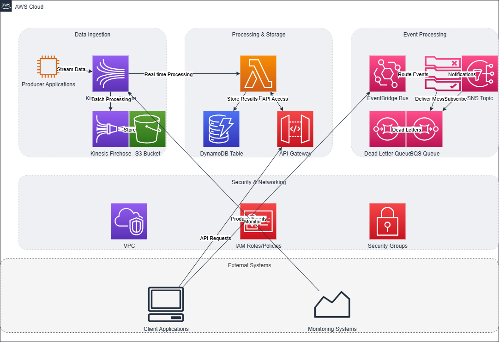

# AWS Trading Infrastructure with Terraform

Production-ready trading infrastructure with ultra-low latency architecture, regulatory compliance, and enterprise-grade security.

## Architecture Overview

### Core Components

**Networking & Security**
- Multi-AZ VPC with public/private subnets
- Enhanced networking (SR-IOV, ENA) for low latency
- VPC endpoints for private connectivity
- Transit Gateway and IPSec VPN
- AWS WAF, Security Groups, KMS encryption
- AWS Secrets Manager for credential management

**Event Processing**
- Kinesis Data Streams (10 shards, 10K+ msg/sec)
- EventBridge for order routing
- SQS/SNS with dead letter queues
- Lambda functions with X-Ray tracing

**Container Orchestration**
- ECS Fargate for serverless containers
- EKS cluster with managed node groups
- Rancher for multi-cluster management
- Application Load Balancer with auto-scaling

**Data & Storage**
- RDS Multi-AZ for high availability
- DynamoDB for real-time data
- S3 with versioning and encryption
- EFS for persistent storage

**Monitoring & CI/CD**
- Prometheus and Grafana dashboards
- CloudWatch with custom metrics
- CodePipeline, CodeBuild, CodeCommit
- AWS Backup with automated snapshots

## Deployment Instructions

### Prerequisites

- AWS CLI configured
- Terraform >= 1.0
- Appropriate AWS permissions

### Step 1: Initialize Terraform

```bash
terraform init
```

### Step 2: Configure Variables

```bash
cp terraform.tfvars.example terraform.tfvars
# Edit with your environment settings
```

### Step 3: Plan Deployment

```bash
terraform plan
```

### Step 4: Deploy Infrastructure

```bash
terraform apply
```

### Step 5: Access Services

- **Grafana**: http://ALB-DNS/grafana (admin/admin123)
- **Rancher**: http://ALB-DNS/rancher (admin/admin123)
- **Prometheus**: http://ALB-DNS/prometheus

## Key Features

- **Ultra-Low Latency**: Sub-millisecond networking with enhanced instances
- **High Availability**: Multi-AZ deployment with automated failover
- **Security**: KMS encryption, WAF protection, VPC isolation
- **Monitoring**: Real-time dashboards and alerting
- **Scalability**: Auto-scaling containers and serverless functions
- **Compliance**: Audit trails and regulatory reporting

## EKS Configuration

```bash
# Configure kubectl
aws eks update-kubeconfig --region us-east-1 --name aws-learning-eks
kubectl get nodes
```

## Cleanup

```bash
terraform destroy
```

## Security Scanning Tools

This project includes multiple security scanning tools to ensure infrastructure code quality and security:

### Implemented Tools

- **Checkov**: Scans for cloud misconfigurations and security issues
- **TFLint**: Validates Terraform code quality and AWS best practices
- **KICS**: Finds security vulnerabilities and compliance issues
- **Terrascan**: Policy-as-code security scanner
- **CloudFormation Guard**: Policy-as-code validation with custom rules

### Using the Security Tools

```bash
# Run security scans locally
./scripts/security-scan.sh

# Run CloudFormation Guard validation
.\guard-validate.ps1

# Set up pre-commit hooks
pre-commit install
```

### CloudFormation Guard Integration

CloudFormation Guard provides additional policy validation with custom organizational rules:

- **Custom Rules**: Organization-specific security policies in `.cfn-guard/rules.guard`
- **Policy as Code**: Version-controlled security policies
- **Compliance Validation**: Structured validation output for audit trails
- **Pre-deployment Checks**: Catch policy violations before infrastructure deployment

```powershell
# Validate infrastructure against custom policies
.\guard-validate.ps1
```

**Guard Rules Include:**
- S3 bucket public access blocking
- KMS key rotation enforcement
- ECS container security (non-root users)
- ALB security headers validation
- CloudWatch logs encryption requirements

All security scans run automatically in CI/CD pipelines.

## Documentation

Comprehensive documentation is available in the `docs/` folder with detailed guides for each component:

### Architecture
- [Detailed Architecture Components](docs/architecture/detailed-components.md) - Complete infrastructure breakdown

### Operations
- [Trading System Exercises](docs/operations/trading-exercises.md) - Learning exercises and advanced implementation paths
- [Troubleshooting Guide](docs/operations/troubleshooting.md) - Common issues and solutions
- [Security Best Practices](docs/operations/security-best-practices.md) - Comprehensive security implementation details

### Deployment
- [Rancher Kubernetes Management](docs/deployment/rancher-management.md) - Complete Kubernetes management guide

### Security
- [Terraform Security Tools Overview](docs/security/terraform-security-tools.md) - Security scanning tools documentation
- [Security Tools Installation Guide](docs/security/installation-guide.md) - Setup instructions for security tools

## Architecture Diagrams

### Infrastructure Overview


### System Layout



For interactive diagrams, see the [infrastructure diagram documentation](docs/infrastructure_diagram/README.md) or open the [draw.io XML file](docs/infrastructure_diagram/aws_kinesis_infrastructure.drawio.xml) in [draw.io](https://app.diagrams.net).